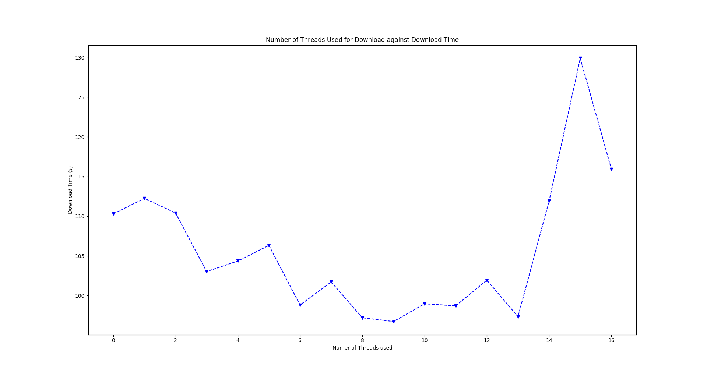

# Case: V

This is a simple HTTP Client, written to be robust and efficient.
Given the url and a file path, the Client will query the server
through ipv4 and ipv6, and based on headers will either spin a
simple thread pool to download chunks, or decide to download the file in one request.

The Client also applies a md5 hash to the downloaded file, to verify its integrity.
If the hash doesn't match, rather than crashing, the Client notifies the user and quits.

# Usage && Requirements

- Clang++-5.0
- BOOST 1.58
- make
- md5sum

The application provides testing scripts to build and execute the application.
The `run*.sh` family scripts build the application, and execute it, hardocoded to
a specific file at a specific url, yet allows for variable amount of threads to be spun.

The `execute*.sh` family scripts only execute the application, assuming that it's been
built prior. These are intended for use in the `benchmark.sh` script, which records the
time it takes wget to download the hardcoded file, then how long it would take the application
to download it with thread pool sizes varying from [1, 16]. The file is run with three passes,
so that an average can be determined for each amounts of threads. There also exists a `graph.py`
script that takes the results from `benchmark.sh` and plots them.

For general use, do the following:
    cd src/
    make
    ./Main <url-filepath> <num-threads> <force-simple>
    // <force-simple> must be a 1 or 0. This is to make the client use the 'simple' download
    // method, which means only using 1 thread.

# Design Decisions && Discussion

Originally the application development was approached from a different perspective:
threads grabbing 'tasks' from a Concurrent queue that was simply the file size split
into chunks, and synchronously writing to a destination file.

This proved troublesome, since while multiple threads can listen on multiple sockets for
incoming data, the file can only be written through one file writer. Thus, there had to
be a balance where threads waited to write, and implementing this 'wait' while having threads
send out multiple http requests, ended up causing massive delays.

Thus, the approach was shifted: instead of grabbing tasks and sending out multiple http requests
per each thread, the threads were assigned a partition of the file size to download, and sent
one large http request for it. Instead of implementing synchronous file writing to a singular file,
the threads each write to their individual temporary files, which get concatenated into the
destination file at the end.

Then, a md5 checksum is calculated, and compared to the original md5 checksum attached with the
file's http headers.

This approach ended up being much faster, and even beats out the wget utility with optimized
threads.

Because I enjoy leveraging new methods from previous implementations, a large amount of the methods
were separated into individual classes and namespaces. The initial `Shared` source files are
partially lifted from a previous IRC client and server, and I wrapped them in a namespace and
made them general, since I will most likely be developing more networks applications in the future.

# Results

The value at n = 0 is for the wget utility, the value at n = 1 is for the simple download
implementation, and the rest are for various thread pool sizes.
